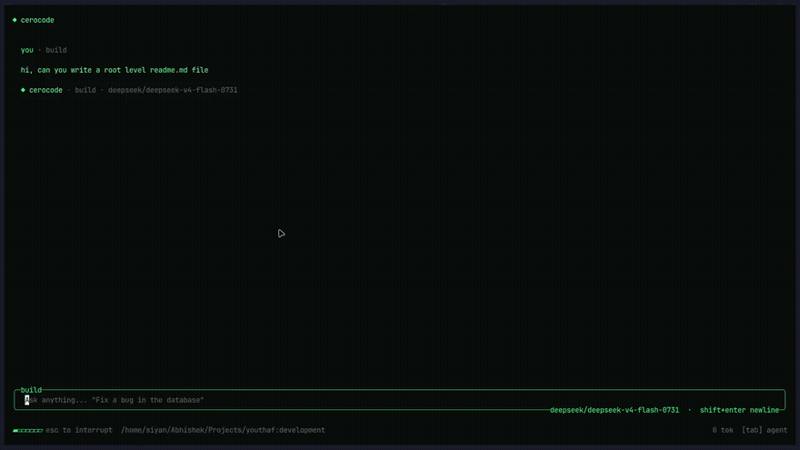

<div align="center">

# cerocode

**An AI coding agent that lives in your terminal.**

Chat with an agent that reads, searches, edits, and writes files, and runs
shell commands in your project — streaming every response back to you as it
works.

[](https://www.npmjs.com/package/cerocode)
[](LICENSE)
[](https://bun.sh)



</div>

## Install

Requires [Bun](https://bun.sh) >= 1.0 — the CLI runs on the Bun runtime.

```sh
bun add -g cerocode
```

```sh
npm install -g cerocode
```

## Quick start

```sh
cd /path/to/your/project
cerocode
```

Sign in with `/login` (opens your browser for OAuth), then just type what you
want done. `Tab` switches between the two agents:

| Agent     | Access                                          |
| --------- | ------------------------------------------------ |
| **BUILD** | Read, write, edit, list, glob, grep, bash         |
| **PLAN**  | Read-only: list, glob, grep — for analysis first  |

Write and `bash` actions ask for your approval before running. Type `/` for
the full command list, `@` to mention a file, and `Esc` to interrupt a
response mid-stream.

## How it's built

A Bun monorepo with four packages:

| Package             | What it does                                                                       |
| -------------------- | ----------------------------------------------------------------------------------- |
| `packages/cli`        | The TUI (OpenTUI + React) — published to npm as [`cerocode`](https://www.npmjs.com/package/cerocode) |
| `packages/server`     | A Hono API handling OAuth, session storage, and streaming chat via the AI SDK        |
| `packages/shared`     | Model registry, agent modes, and tool schemas shared by the CLI and server           |
| `packages/database`   | Drizzle schema and Postgres client for session storage                              |
| `packages/web`        | The website — landing page and [documentation](https://cerocode.heyabhishek.in/docs) |

The CLI talks to the hosted cerocode service by default; point it at a local
server instead by setting `NODE_ENV=development` (see [Configuration](#configuration)).

Models come from Groq, Mistral, and Google through the [AI SDK](https://ai-sdk.dev),
with `devstral-small-latest` as the default.

## Development

```sh
git clone git@github.com:AbhishekSinghDev/cerocode.git
cd cerocode
bun install
```

Run the server and CLI in two terminals:

```sh
bun run dev:server   # Hono server with hot reload, http://localhost:3000
bun run dev:cli      # CLI in watch mode, pointed at localhost:3000
```

See [CONTRIBUTING.md](CONTRIBUTING.md) for full setup (database, Clerk, and
model API keys) and [.env.example](.env.example) for the server's environment
variables.

### Build & publish

```sh
bun run build       # builds the CLI and server bundles
bun run link:cli     # builds the CLI and links it globally with bun link
```

Only `packages/cli` is published. Its build inlines every workspace
dependency, so the published tarball has no `workspace:*` or `@cerocode/*`
runtime dependencies — just `dist`, `bin`, `README.md`, and `LICENSE`.

## Configuration

<details>
<summary><strong>CLI</strong></summary>

No setup is required — production endpoints are baked in.

| Variable   | Effect                                                                                                |
| ---------- | ------------------------------------------------------------------------------------------------------ |
| `NODE_ENV` | `development` points the CLI at `http://localhost:3000` and the dev Clerk app instead of the hosted ones |

The auth token lives in `~/.cerocode/auth.json`; delete it to sign out.

</details>

<details>
<summary><strong>Server</strong></summary>

Bun loads `.env` automatically. Copy [.env.example](.env.example) to `.env`
and fill in:

| Variable                        | Required | Purpose                                          |
| -------------------------------- | -------- | -------------------------------------------------- |
| `DATABASE_URL`                    | yes      | Postgres connection string                          |
| `CLERK_SECRET_KEY`                | yes      | Clerk backend secret                                |
| `CLERK_PUBLISHABLE_KEY`           | yes      | Clerk frontend API key                              |
| `GOOGLE_GENERATIVE_AI_API_KEY`    | no       | Enables Google models                               |
| `GROQ_API_KEY`                    | no       | Enables Groq models                                 |
| `MISTRAL_API_KEY`                 | no       | Enables Mistral models (the default model's provider) |

</details>

## Contributing

Contributions are welcome — see [CONTRIBUTING.md](CONTRIBUTING.md) for the
full setup and workflow.

## License

[MIT](LICENSE)
